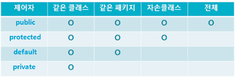

## 잘 설계된 컴포넌트?
👉 독립적인 컴포넌트

## 독립적이면 뭐가 좋을까?
- 다른 컴포넌트와 병렬적으로 개발할 수 있다.
- 다른 컴포넌트와는 독립적으로 테스트 해볼 수 있다.
- 소프트웨어 재사용성을 높일 수 있다.
- 구현의 변경이 미치는 영향이 작아진다.

## 컴포넌트를 독립적으로 만드는 방법
👉 인터페이스만을 제공하고 내부 구현을 숨겨야 한다.
> 외부에 정보를 최소한으로만 제공해야 한다. 이를 정보은닉이라고 한다. 

자바에서는 접근제어자를 통해 권한을 최소화할 수 있다.

## 클래스와 인터페이스
👉 top-level 클래스와 인터페이스는 public과 package-private만 지원
- public: 모든 곳에서 사용가능하다. 만약 버전이 변하더라도 하위 호환을 위해 계속 지원해줘야 한다. 예시) Vector, Stack
- package-private: 패키지 내에서만 접근 가능하다. 공개되지 않기 때문에 추가, 수정, 삭제가 자유롭다. 

👉 private static: 이 클래스를 포함하는 외부 클래스에서만 접근할 수 있다. 만일 한 클래스에서만 사용되는 클래스라면 사용하자.

## 멤버(필드, 메서드, 중첩 클래스, 중첩 인터페이스)


### 필드가 열려있는 경우
```
// client
public void move() {
    cars.forEach(car -> car.x += 1);
}

// server
package com.server.car

public class Car {
    public int x;
}
```
👉 만일 x가 가변 객체였다면 내부 상태를 더 이상 보장할 수 없게 된다. 

👉 final이 아니라면 Car의 상태에 대한 책임도 더 이상 Car에 있지 않다.

👉 x가 불변 객체라도 이름을 변경하고 싶다면??

👉 만약 로직이 바껴서 x를 제거하고 싶다면??

### 정보가 은닉되지 않았을 때 요구사항이 변하면 어떻게 될까?

```
Cars cars = Cars.of(List.of(new Car("에밀"), new Car("오리"), new Car("모디"), new Car("에단"), new Car("디투"), new Car("홍실")));
raceResult = Circuit.race(cars);

class Circuit {
    public static RaceResult race(Cars cars) {
        List<Car> carList = cars.getCars();
        for (int i = 0; i < carList.size(); i++) {
            carList.get(i).move();
        }
        ...
        return raceResult;
    }
}

public class Cars {
    private List<Car> cars;
    
    public static Cars of(List<String> names) {
        ...
    }
    
    public List<Car> getCars() {
        return cars;
    }
}

...

결과
에밀: 10 -> +5점
나머지: 0 -> +0점
```

👉 Cars의 Car를 외부에서 쉽게 변경할 수 있다.

👉 요구사항이 변경되어 라운드제 게임으로 변경된다면? --> 점수 초기화가 필요하다.

```
class Circuit {
    public static RaceResult race(Cars cars) {
        List<Car> carList = cars.getCars();
        for (int i = 0; i < carList.size(); i++) {
            carList.get(i).move();
        }
        ...
        cars.initialize()
        return raceResult;
    }
}

public class Cars {
    private List<Car> cars;
    
    public static Cars of(List<String> names) {
        ...
    }
    
    public void initialilze() {
        cars.forEach(Car::initialize);
    }
    
    public List<Car> getCars() {
        return cars;
    }
}
```

👉 두 군데의 변경 사항이 발생했다. --> SRP 원칙 위배

```
public class Cars {
    private List<Car> cars;
    
    public static Cars of(List<String> names) {
        ...
    }
    
    public RaceResult race() {
        cars.forEach(Car::move());
        initialize();
    }
    
    private void initialilze() {
        cars.forEach(Car::initialize);
    }
    
    public List<Car> getCars() {
        return cars;
    }
}

```

👉 캡슐화가 잘 되었다면 한 군데만 수정해도 충분하다.

### 테스트를 위해 멤버를 protected로 변경한다면..?

```
// production
public class LadderGenerator {
    public Ladder generate() {
        ...
    }
    
    protected Row generateRow() {
        ...
    }
}

// test
class LadderGeneratorTest extends LadderGenerator {
    @Test
    void generateRowTest() {
        assertThat(ladder.generateRow()).isEqualTo(...);
    }
}
```

👉 테스트를 위해 protected로 접근 제어자를 변경하게 되면
- protected의 의도를 알아차리기 힘들어 가독성이 떨어진다.
- public 클래스의 protected 멤버는 계속해서 지원돼야 한다. 
- 상속을 유발하게 되어 프로그램 구조를 경직되게 만들 수 있다.

### 범위를 줄이지 못하게 하는 요소
👉 상속 후 override를 할 경우 해당 메서드는 부모 클래스의 메서드보다 범위를 좁게 할 수 없다. --> 리스코프의 치환 원칙 때문

### 배열이나 리스트를 주입받거나 반환해야 하는 경우
👉 방어적 복사, 불변 객체를 가능한 최대로 활용하도록 하자.